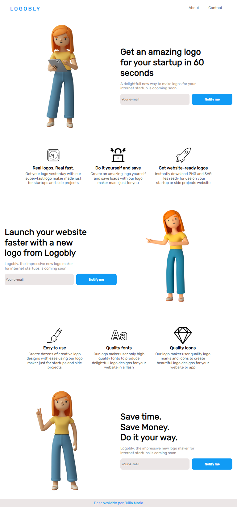
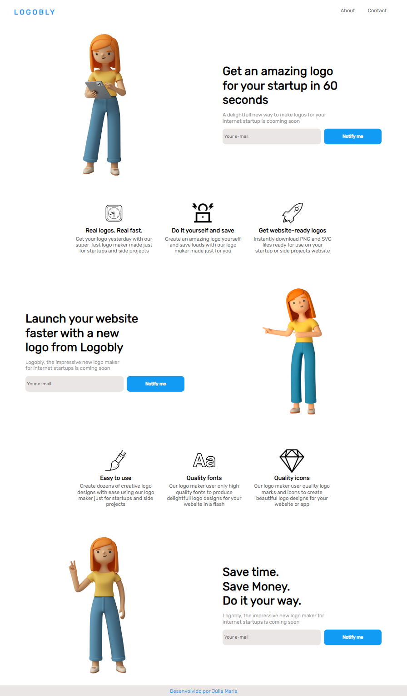

  <h1>LANDING PAGE</h1>
  
  

    Landing Page totalmente responsiva, desenvolvida com: HTML, CSS e JS.
  

   
   
  
  <h2 align="center">Deploy do Site</h2>
  
  

    O site está disponível em: <a href="https://juliamariaa.github.io/LandingPage/">https://juliamariaa.github.io/LandingPage/</a>
  

   
  <h2 align="center">Design Inspiração</h2>
  
  

    
  

   
  <h2 align="center">Screenshots</h2>
   
  <h3 align="center">Design Mobile</h3>

  

    
  

   
  <h3 align="center">Design Tablet</h3>

  

    
  

   
  <h3 align="center">Design Desktop</h3>

  

    
  

   
   
  <h2 align="center">Desenvolvido por Júlia Maria</h2>

